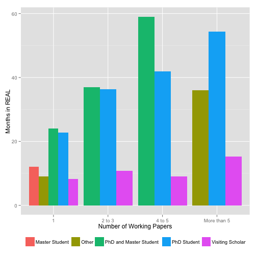

## Outline

>1. The Instrument
>2. Exploratory Analysis
>3. The REAL Mafia in a Network context
  - Academic
  - Friendship
>4. Spatial Analysis
>5. The REAL Virtual Yearbook
>6. Memories Semantic Analysis

--- 

## The Instrument

<!-- Table generated in R 3.1.1 by googleVis 0.5.5 package -->
<!-- Sun Nov  2 19:13:57 2014 -->

<!-- jsHeader -->

 
<!-- jsChart -->  

 
<!-- divChart -->
  

<!-- Table generated in R 3.1.1 by googleVis 0.5.5 package -->
<!-- Sun Nov  2 19:13:57 2014 -->

<!-- jsHeader -->

 
<!-- jsChart -->  

 
<!-- divChart -->
  

 

- Sampled REAL Mafia: _400 (aprox.) e-mails sent_
- Number of Respondents REAL Mafia: _104 responded surveys_
- Number of attendants to this event: _120 aprox._ 

---

## The 'Actual' Instrument

<iframe src="https://docs.google.com/forms/d/1B3qXUtLhqH7JSpo1zLH0DZeEzPPt0YIXEMp48NUA0eI/viewform?edit_requested=true" heingt='600px'></iframe>

--- .segue bg:indigo

## Exploratory Analysis

---  &vcenter

## Demographic Frequencies

<table style="text-align:center"><tr><td colspan="5" style="border-bottom: 1px solid black"></td></tr><tr><td style="text-align:left"></td><td>Degree</td><td>Affiliation</td><td>Position</td><td>Mafia Type</td></tr>
<tr><td colspan="5" style="border-bottom: 1px solid black"></td></tr><tr><td style="text-align:left"></td><td>BA : 3</td><td>University of Oviedo: 4</td><td>Professor :16</td><td>Master Student : 1</td></tr>
<tr><td style="text-align:left"></td><td>MA : 2</td><td>CEDEPLAR/UFMG : 3</td><td>Assistant Professor: 8</td><td>Other : 2</td></tr>
<tr><td style="text-align:left"></td><td>MS :13</td><td>UIUC : 3</td><td>Associate Professor: 8</td><td>PhD and Master Student: 4</td></tr>
<tr><td style="text-align:left"></td><td>Other: 1</td><td>CIDE : 2</td><td>PhD Candidate : 8</td><td>PhD Student :43</td></tr>
<tr><td style="text-align:left"></td><td>PhD :85</td><td>OECD : 2</td><td>Economist : 4</td><td>Visiting Scholar :54</td></tr>
<tr><td style="text-align:left"></td><td></td><td>REAL : 2</td><td>Full Professor : 3</td><td></td></tr>
<tr><td style="text-align:left"></td><td></td><td>(Other) :88</td><td>(Other) :57</td><td></td></tr>
<tr><td colspan="5" style="border-bottom: 1px solid black"></td></tr></table>

---  &vcenter

## Initial Country

<!-- GeoChart generated in R 3.1.1 by googleVis 0.5.5 package -->
<!-- Sun Nov  2 14:12:58 2014 -->

<!-- jsHeader -->

 
<!-- jsChart -->  

 
<!-- divChart -->
  

<!-- GeoChart generated in R 3.1.1 by googleVis 0.5.5 package -->
<!-- Sun Nov  2 14:12:58 2014 -->

<!-- jsHeader -->

 
<!-- jsChart -->  

 
<!-- divChart -->
  

---  &vcenter

## Current Country

<!-- GeoChart generated in R 3.1.1 by googleVis 0.5.5 package -->
<!-- Sun Nov  2 14:12:58 2014 -->

<!-- jsHeader -->

 
<!-- jsChart -->  

 
<!-- divChart -->
  

<!-- GeoChart generated in R 3.1.1 by googleVis 0.5.5 package -->
<!-- Sun Nov  2 14:12:58 2014 -->

<!-- jsHeader -->

 
<!-- jsChart -->  

 
<!-- divChart -->
  

--- 
## Duration in REAL

<!-- Histogram generated in R 3.1.1 by googleVis 0.5.5 package -->
<!-- Sat Nov  8 10:36:58 2014 -->

<!-- jsHeader -->

 
<!-- jsChart -->  

 
<!-- divChart -->
  

- Mafia type by duration:
  - _0-14_: Short term scholars (Spaniards & Brazilian Sandwich Mostly)
  - _14-28_: Long term scholars & Masters
  - _28+_: PhD Students and REAL lovers.

--- .segue bg:indigo

## Academics at REAL

--- &twocol w1:45% w2:35% &vcenter

## 1st most important research area at REAL.
*** =left
<!-- PieChart generated in R 3.1.1 by googleVis 0.5.5 package -->
<!-- Fri Nov  7 06:28:48 2014 -->

<!-- jsHeader -->

 
<!-- jsChart -->  

 
<!-- divChart -->
  

<!-- PieChart generated in R 3.1.1 by googleVis 0.5.5 package -->
<!-- Fri Nov  7 06:28:48 2014 -->

<!-- jsHeader -->

 
<!-- jsChart -->  

 
<!-- divChart -->
  

*** =right

>- <strong> within Regional Economic Growth falls:</strong>
    - Neoclasical, Endogenous & Spatial Growth Models
    - CGEs, static, dynamic and spatial
    - Regional growth and convergence
    - Spatial Policy for Growth and Equity

>- _together Growth, Spatial Econometrics, Housing & Labor make up to 63%_

--- &twocol w1:45% w2:35% &vcenter

## 2nd most important research area at REAL.
*** =left
<!-- PieChart generated in R 3.1.1 by googleVis 0.5.5 package -->
<!-- Fri Nov  7 06:33:32 2014 -->

<!-- jsHeader -->

 
<!-- jsChart -->  

 
<!-- divChart -->
  

<!-- PieChart generated in R 3.1.1 by googleVis 0.5.5 package -->
<!-- Fri Nov  7 06:33:32 2014 -->

<!-- jsHeader -->

 
<!-- jsChart -->  

 
<!-- divChart -->
  

*** =right
>- All spatial sciences grow in importance
>- Further survey should have a finer categorization

--- &vcenter

## Productivity by Research Area (1st)

<!-- ColumnChart generated in R 3.1.1 by googleVis 0.5.5 package -->
<!-- Sat Nov  8 12:08:53 2014 -->

<!-- jsHeader -->

 
<!-- jsChart -->  

 
<!-- divChart -->
  

--- &vcenter
## Productivity by Research Area (1st) & No. of Months

<!-- ColumnChart generated in R 3.1.1 by googleVis 0.5.5 package -->
<!-- Sat Nov  8 12:08:53 2014 -->

<!-- jsHeader -->

 
<!-- jsChart -->  

 
<!-- divChart -->
  

--- &vcenter

## Productivity by Research Area (2nd)

<!-- ColumnChart generated in R 3.1.1 by googleVis 0.5.5 package -->
<!-- Sat Nov  8 13:17:59 2014 -->

<!-- jsHeader -->

 
<!-- jsChart -->  

 
<!-- divChart -->
  

--- &vcenter
## Productivity by Research Area (2nd) & No. of Months

<!-- ColumnChart generated in R 3.1.1 by googleVis 0.5.5 package -->
<!-- Sat Nov  8 13:17:59 2014 -->

<!-- jsHeader -->

 
<!-- jsChart -->  

 
<!-- divChart -->
  

--- &vcenter

## Productivity by Mafia Type

 

---

## The REAL Mafia in a Network Context (Academics)

<iframe src="http://www.real.illinois.edu/networksVis/REALAcademicNet2/network/index.html#" heingt='600px'></iframe>
